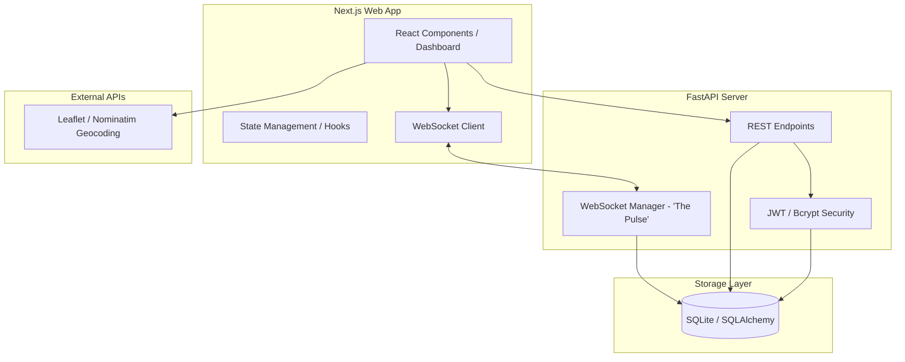
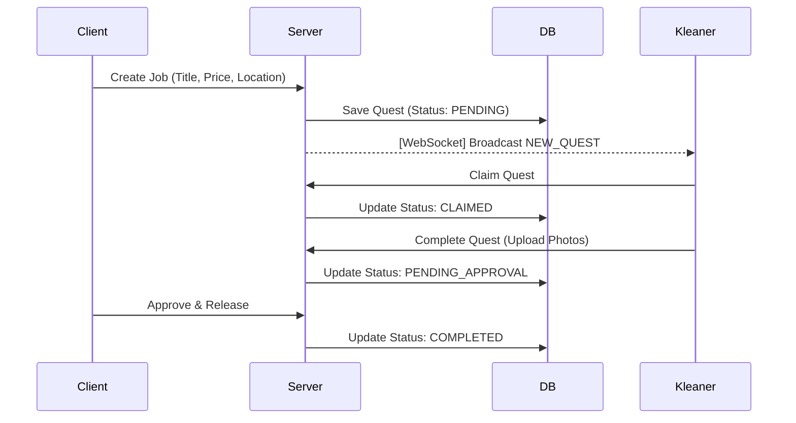

<h1 align="center">KLeanerZ</h1>

<p align="center">
  A modern, Gen-Z focused gig-economy platform for residential cleaning services, using a "Claim-and-Go" model.
</p>

<p align="center">
  
  
  
  
</p>

---

*   If you find this project impressive for a portfolio, please consider giving it a star!

**KLeanerZ** is a high-transparency marketplace designed for the next generation of clients and cleaners. It replaces traditional, slow booking systems with a real-time "Quest Board" where cleaners can instantly claim jobs, and clients can track progress through visual "Proof of Work" (Before/After photos).

The system features robust **Role-Based Access Control (RBAC)**, real-time updates via **WebSockets**, and a curated "Cyber-Terminal" aesthetic.

---

## 🏗️ System Architecture

KLeanerZ utilizes a decoupled architecture to ensure real-time performance and scalability of the "Quest" lifecycle.



### 🔄 The Quest Lifecycle Flow

The "Claim-and-Go" engine handles race conditions ensures the first-come, first-served logic.



---

## � User Interface

The application features a modern "Cyber-Terminal" dark theme with neon accents, optimized for both desktop and mobile PWA usage.

### Landing & Discovery
High-conversion landing page with role-selection for Clients and KleanerZ.


### Quest Board (Kleaner View)
Real-time feed of available jobs with map integration and instant claiming.


### Client Management Dashboard
Track active jobs, review applicants, and release payments upon approval.


### Real-Time Messaging
In-app communication between participants once a quest is active.


---

## ⚡ Features

*   **The Pulse (WebSockets)**: Instant job broadcasting to all nearby cleaners.
*   **Proof of Work**: Visual verification system (Before/After photos) for transparency.
*   **Smart Geocoding**: Automatic address verification and demand heatmapping via Leaflet.
*   **Wallet System**: Integrated earnings tracking and automated payment release flow.
*   **Role-Based Security**: Secure JWT authentication with 24h session tokens.
*   **PWA Ready**: Installable on home screens for a native mobile experience.

---

## 🛠️ Requirements

*   **Python**: 3.10+
*   **Node.js**: 18.x or higher
*   **Database**: SQLite (built-in) or PostgreSQL

---

## 🚀 Installation & Setup

1. **Clone the Repository**:
   ```bash
   git clone https://github.com/huwanbisente/KleanerZ.git
   cd KleanerZ
   ```

2. **Backend Setup**:
   ```bash
   cd backend
   python -m venv .venv
   source .venv/bin/activate  # Windows: .venv\Scripts\activate
   pip install -r requirements.txt
   python scripts/setup_test_data.py # Seeds the DB with demo accounts
   uvicorn main:app --reload
   ```

3. **Frontend Setup**:
   ```bash
   cd ../frontend
   npm install
   npm run dev
   ```

---

## 🔑 Demo Access

Explore the platform perspectives using these pre-seeded demo accounts:

| Role | Email | Password |
| :--- | :--- | :--- |
| **Client** | `demo_client@kleanerz.com` | `password123` |
| **Kleaner** | `demo_cleaner@kleanerz.com` | `password123` |

---

## � Project Structure

```text
├── backend/                # FastAPI Application
│   ├── core/               # Auth & WebSockets
│   ├── models/             # SQLAlchemy Models
│   ├── routers/            # API Endpoints
│   ├── schemas/            # Pydantic Types
│   └── scripts/            # Seed & Utility Scripts
├── frontend/               # Next.js Application
│   ├── src/
│   │   ├── components/     # UI Design System
│   │   ├── pages/          # Dashboards & Auth
│   │   └── utils/          # API Handlers
└── README.md
```
