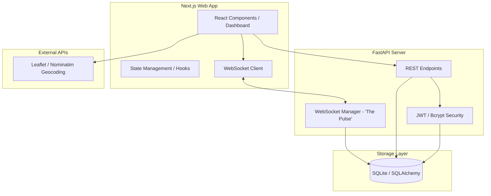
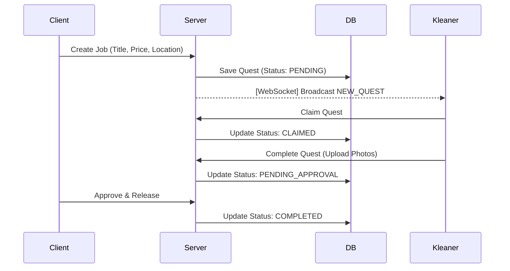

# 🧹 KLeanerZ (Project KleanerZ)
### *Cleaning but make it aesthetic.*

**KLeanerZ** is a modern, Gen-Z focused gig-economy platform for residential cleaning services. Built with a high-transparency, "Claim-and-Go" model, it connects clients looking for a space refresh with professional cleaners looking for flexible, fair-pay opportunities.

---

## 🚀 Vision & Key Features

KLeanerZ isn't just a booking app; it's a "Mission-based" ecosystem designed for speed and visual trust.

- **⚡ The Pulse (WebSockets)**: Real-time "Quest Board" updates. Cleaners see new opportunities instantly without refreshing.
- **🛡️ Secure Auth**: JWT-based authentication with role-based dashboards (Client vs. Kleaner).
- **📍 Smart Geocoding**: Integrated mapping for precise location tracking and demand heatmaps.
- **📸 Proof of Work**: Visual verification system for job completion and quality control.
- **💎 Premium UI**: Dark-mode terminal aesthetic with neon accents and high-contrast visuals.

---

## 🏗️ System Architecture

KLeanerZ uses a modern decoupled architecture designed for high concurrency and real-time state management.



### 🔄 The Quest Lifecycle Flow



---

## 💻 Tech Stack

- **Frontend**: `Next.js 16`, `React 19`, `TailwindCSS` (Design Tokens), `Lucide icons`.
- **Backend**: `Python 3.10+`, `FastAPI`, `Uvicorn`, `PyJWT`.
- **Database**: `SQLAlchemy ORM`, `SQLite` (MVP).
- **Maps**: `React-Leaflet`, `OpenStreetMap (Nominatim)`.

---

## 📸 Screenshots

| Landing Page | Client Dashboard |
| :--- | :--- |
|  |  |

| Kleaner Board | Real-time Messaging |
| :--- | :--- |
|  |  |

---

## 🛠️ Getting Started

### Prerequisites
- Python 3.10+
- Node.js 18+
- Git

### 1. Clone the Repository
```bash
git clone https://github.com/yourusername/KLeanerZ.git
cd KLeanerZ
```

### 2. Backend Setup
```bash
cd backend
python -m venv .venv
source .venv/bin/activate  # Windows: .venv\Scripts\activate
pip install -r requirements.txt
python scripts/setup_test_data.py # Seeds the DB with demo data
uvicorn main:app --reload
```

### 3. Frontend Setup
```bash
cd ../frontend
npm install
npm run dev
```

---

## 🔑 Demo Access

To quickly explore the different platform perspectives, use these pre-seeded credentials:

| Role | Email | Password |
| :--- | :--- | :--- |
| **Client** | `demo_client@kleanerz.com` | `password123` |
| **Kleaner** | `demo_cleaner@kleanerz.com` | `password123` |

---

## 📄 License & Contact
Distributed under the MIT License. See `LICENSE` for more information.

**Project Link**: [https://github.com/yourusername/KLeanerZ](https://github.com/yourusername/KLeanerZ)
